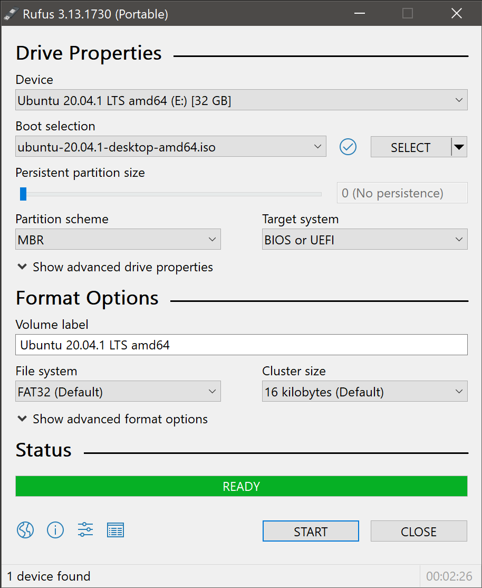
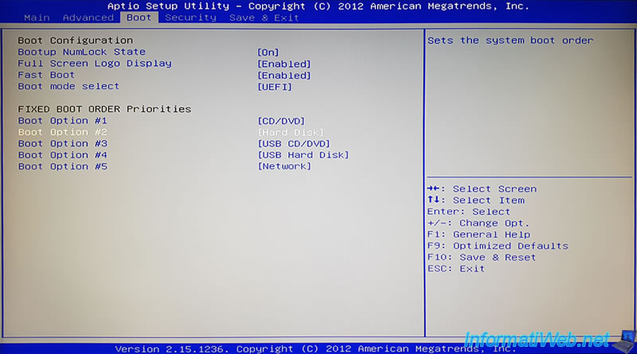

# Complete Guide to Switching to Linux on SSD/Hard Disk

> 🔥 **Welcome to your new Linux experience!**  
> Tired of Windows/macOS or bought a new PC and want to take full advantage of open-source? This step-by-step guide will take you from zero to your first Linux boot.

---

## Table of Contents

1. [Introduction](#introduction)  
2. [Prerequisites](#prerequisites)  
3. [Downloading the ISO and Creating a Bootable USB](#downloading-the-iso-and-creating-a-bootable-usb)  
   1. [Downloading the ISO](#downloading-the-iso)  
   2. [Preparing the USB Drive](#preparing-the-usb-drive)  
   3. [Recommended Tools for Windows/macOS/Linux](#recommended-tools-for-windowsmacoslinux)  
4. [BIOS/UEFI Configuration](#biosuefi-configuration)  
5. [Installing Linux on SSD/Hard Disk](#installing-linux-on-ssdhard-disk)  
   1. [Booting from USB](#booting-from-usb)  
   2. [Partitioning and Formatting](#partitioning-and-formatting)  
   3. [Basic Installation](#basic-installation)  
6. [Post-Installation: Initial Setup](#post-installation-initial-setup)  
   1. [Updating the System](#updating-the-system)  
   2. [Installing Additional Drivers](#installing-additional-drivers)  
   3. [Essential Software](#essential-software)  
7. [Most Popular Linux Distributions](#most-popular-linux-distributions)  
   1. [Ubuntu](#ubuntu)  
   2. [Linux Mint](#linux-mint)  
   3. [Fedora](#fedora)  
   4. [Debian](#debian)  
   5. [Manjaro](#manjaro)  
   6. [Pop!\_OS](#pop_os)  
8. [Additional Resources](#additional-resources)  
9. [License](#license)  

---

## Introduction

Switching to Linux may seem daunting if you’ve never used an open-source operating system. In reality, most modern distributions (called “distros”) offer guided installers, intuitive interfaces, and a vast community ready to help.  

**Goals of this guide:**  
- Show you how to prepare a USB stick with a Linux ISO.  
- Walk you through each installation screen, from boot to first login.  
- Provide official links to the most popular distros so you can pick what suits you best.  
- Help you configure your system after installation (drivers, software, etc.).  

> ℹ️ **Who is this guide for?**  
> - Absolute beginners who have only used Windows/macOS.  
> - Anyone seeking a more stable, secure, and customizable OS.  
> - Students or professionals needing an open-source environment (programming, graphics, servers, etc.).  

---

## Prerequisites

Before you begin, make sure you have:  

1. **A PC with an SSD or Hard Disk**  
   - If it’s a new PC, confirm you have at least one drive bay (SATA or NVMe).  
   - If you’re dual-booting with Windows, back up any important data first.  

2. **A USB stick of at least 4 GB**  
   - Recommended: 8 GB or larger, to accommodate heavier distros.  
   - Note: all data on the USB stick will be erased when you make it bootable.  

3. **An Internet connection**  
   - Needed to download the ISO and, later, updates and drivers.  

4. **Another computer (or the same one) to create the USB stick**  
   - It can be running Windows, macOS, or a different Linux.  

---

## Downloading the ISO and Creating a Bootable USB

### 1. Downloading the ISO

1. Choose the distribution you prefer (see [“Most Popular Linux Distributions”](#most-popular-linux-distributions) below for details).  
2. Go to the distro’s official website (links provided later) and download the ISO file. It usually lands in your `Downloads` folder.

> 📝 Example: For Ubuntu, visit https://ubuntu.com/download/desktop and click “Download” under the LTS (Long Term Support) version.  

---

### 2. Preparing the USB Drive

#### 2.1 Windows: Rufus

1. Download Rufus from https://rufus.ie/ and run it (no installation required).  
2. Insert your USB stick into a free USB port.  
3. In “Device,” select your USB stick.  
4. Under “Boot selection,” click “SELECT” and choose the ISO you just downloaded.  
5. Leave all other options at default (File system: FAT32).  
6. Click “START” and confirm any warnings (data will be erased).  
7. Wait for the process to finish.

>   
> *Example of Rufus configuration on Windows.*  

---

#### 2.2 macOS: balenaEtcher

1. Download balenaEtcher from https://www.balena.io/etcher/.  
2. Install and launch balenaEtcher.  
3. Insert your USB stick into a USB port.  
4. Click “Flash from file” and select the ISO.  
5. Choose your USB stick as the target.  
6. Click “Flash!” and wait for the writing to complete.  
7. Once done, safely eject the USB stick.  

---

#### 2.3 Linux: `dd` or balenaEtcher

- **With balenaEtcher**: Same steps as on macOS.  
- **With `dd` (terminal method)**:  
  1. Open a terminal.  
  2. Identify the USB device:  
     ```bash
     sudo lsblk
     ```  
     Look for the line matching your USB stick (e.g., `/dev/sdb`).  
  3. Run the following command (replace `/dev/sdX` with the correct device name, without a number; e.g., `/dev/sdb`):  
     ```bash
     sudo dd if=/path/to/your/iso-file.iso of=/dev/sdX bs=4M status=progress oflag=sync
     ```  
  4. Wait for it to finish (no need to “eject”—`dd` writes everything before exiting).  

> ⚠️ **WARNING:** If you choose `dd`, double-check your target device. Writing to the wrong disk will permanently erase its data.

---

## BIOS/UEFI Configuration

To boot from the USB stick, you must access your PC’s BIOS/UEFI settings:

1. **Power on/restart** your PC.  
2. During the initial splash screen, press the key to enter BIOS/UEFI (often `F2`, `F10`, `F12`, `DEL`, or `ESC`, depending on the manufacturer).  
3. In the BIOS/UEFI interface:  
   - **UEFI Mode**: find the “Boot” or “Boot Order” section.  
   - Move “USB” or “Removable Devices” to the top of the list.  
   - If “Secure Boot” is enabled, disable it (modern distros often support Secure Boot, but turning it off is safer for installation).  
4. Save changes (usually `F10`) and reboot.

>   
> *Example of a UEFI screen showing USB as first boot device.*  

---

## Installing Linux on SSD/Hard Disk

### 1. Booting from USB

1. With the USB stick plugged in, power on the PC. You should see the Linux live environment or installer menu (wording varies by distro, e.g., “Try Ubuntu without installing,” “Start Fedora Live,” etc.).  
2. Most installers give you two main options:  
   - **Try the distro in Live mode** (no installation, just a test).  
   - **Install directly** (e.g., “Install Ubuntu,” “Install Fedora”).  
3. We recommend selecting “Install” right away so you can proceed with the installation steps.

---

### 2. Partitioning and Formatting

Exact steps differ slightly between distros, but the principles are identical:

1. **Language**: choose your preferred language (e.g., English).  
2. **Time zone**: usually detected automatically.  
3. **Keyboard layout**: select “Italian” or whichever layout you use.  
4. **Installation type**:  
   - **Standard installation** (recommended for beginners): the installer automatically creates partitions (root, swap, home).  
   - **Manual partitioning** (for advanced users or dual-boot scenarios): you can create:  
     - `/` (root) – at least **20 GB**, formatted as ext4.  
     - `/home` (user data) – as large as you want (e.g., the rest of the disk), formatted as ext4.  
     - `swap` – at least equal to your RAM if you want hibernation, otherwise half your RAM is sufficient.  
5. Select the target drive (SSD or Hard Disk).  
6. Confirm: **WARNING**: This will erase all data on the chosen disk if you overwrite it.

>   
> *Example of manual partitioning with LVM on Ubuntu.*  

---

### 3. Basic Installation

1. **Create your user**: enter your name, computer name (hostname), and a password.  
2. **Install GRUB**: the bootloader that lets you pick between Linux and other OSes (if dual-booting).  
3. Click “Install” to begin the copy/install process.  
4. Wait for completion: depending on your hardware and distro, this can take 5–20 minutes.

>   
> *Once finished, you’ll be prompted to reboot.*  

5. **Reboot** without the USB stick inserted (remember to eject it).  
6. You’ll see the GRUB menu on startup, which will load Linux by default.

---

## Post-Installation: Initial Setup

### 1. Updating the System

Open a terminal and run the following commands, depending on your distro:

- **Ubuntu/Debian/Linux Mint/Pop!\_OS**:
  ```bash
  sudo apt update && sudo apt upgrade -y

* **Fedora**:

  ```bash
  sudo dnf upgrade --refresh -y
  ```
* **Manjaro (Arch-based)**:

  ```bash
  sudo pacman -Syu
  ```

---

### 2. Installing Additional Drivers

1. **NVIDIA/AMD graphics**:

   * On Ubuntu/Mint/Pop!\_OS, use “Additional Drivers” (Software & Updates → “Additional Drivers” tab).
   * On Fedora:

     ```bash
     sudo dnf install akmod-nvidia       # for NVIDIA
     sudo dnf install xorg-x11-drv-amdgpu  # for AMD
     ```
   * On Manjaro:

     ```bash
     sudo mhwd -a pci nonfree 0300  # automatically installs NVIDIA drivers
     ```
2. **Wi-Fi/Bluetooth**: usually detected automatically. If your network doesn’t work, search for the proprietary package (e.g., `broadcom-sta-dkms` on Debian/Ubuntu).

---

### 3. Essential Software

Below are some recommended packages (adjust according to your needs):

* **Web Browsers**:

  * `firefox` (preinstalled on many distros)
  * `chromium` or `google-chrome-stable`

* **Terminal Tools**:

  ```bash
  sudo apt install build-essential git curl wget vim      # for Debian-based
  sudo dnf install @development-tools git curl wget vim   # for Fedora
  sudo pacman -S base-devel git curl wget vim              # for Manjaro
  ```

* **PDF Reader**:

  * `evince`, `okular` or `xreader`.

* **Office Suite**:

  * `libreoffice`.

* **Multimedia Codecs** (some distros don’t include them by default):

  * Ubuntu/Mint/Pop!\_OS:

    ```bash
    sudo apt install ubuntu-restricted-extras
    ```
  * Fedora:

    ```bash
    sudo dnf install rpmfusion-free-release-tainted
    sudo dnf groupupdate multimedia --setop="install_weak_deps=False" --exclude=PackageKit-gstreamer-plugin
    ```

* **Graphics Editors**:

  * `gimp`, `inkscape`, `krita`.

* **Virtualization** (optional):

  * `virtualbox`, or `kvm` + `virt-manager`.

---

## Most Popular Linux Distributions

Below is an overview of the most widely used distros, with official links, minimum requirements, and key strengths.

### 1. Ubuntu

* **Official website**: [ubuntu.com](https://ubuntu.com/)
* **Type**: Debian-based, default desktop is GNOME.
* **Minimum requirements**:

  * CPU: 2 GHz dual-core
  * RAM: 4 GB (8 GB recommended)
  * Disk space: 25 GB
* **Key strengths**:

  * Huge community and extensive documentation.
  * Long Term Support (LTS) releases supported for 5 years.
  * Very user-friendly for newcomers from Windows/macOS.

---

### 2. Linux Mint

* **Official website**: [linuxmint.com](https://linuxmint.com/)
* **Type**: Ubuntu-based, offers Cinnamon, MATE, or Xfce desktop environments.
* **Minimum requirements** (Cinnamon edition):

  * CPU: 1 GHz dual-core
  * RAM: 2 GB (4 GB recommended)
  * Disk space: 20 GB
* **Key strengths**:

  * Windows-like interface for former Windows users.
  * Clean, stable, and highly customizable desktop.
  * Excellent built-in tools (Mint Update Manager, Mint Software Manager).

---

### 3. Fedora

* **Official website**: [getfedora.org](https://getfedora.org/)
* **Type**: Red Hat-based; “Workstation” edition uses GNOME.
* **Minimum requirements**:

  * CPU: 2 GHz dual-core
  * RAM: 4 GB (8 GB recommended)
  * Disk space: 25 GB
* **Key strengths**:

  * Cutting-edge technologies (Wayland, PipeWire, SELinux).
  * New major release every 6 months.
  * Ideal for developers and those who want up-to-date software.

---

### 4. Debian

* **Official website**: [debian.org](https://www.debian.org/)
* **Type**: Known for rock-solid stability and long lifespan.
* **Minimum requirements**:

  * CPU: 1 GHz
  * RAM: 512 MB (1 GB recommended)
  * Disk space: 10 GB
* **Key strengths**:

  * Extremely stable (Stable release updated approximately every 2 years).
  * Huge repository of packages (APT).
  * Great for servers, desktops, and embedded projects.

---

### 5. Manjaro

* **Official website**: [manjaro.org](https://manjaro.org/)
* **Type**: Arch-based, but with a graphical installer and preconfigured defaults.
* **Minimum requirements** (Xfce edition):

  * CPU: 1 GHz dual-core
  * RAM: 1 GB (2 GB recommended)
  * Disk space: 30 GB
* **Key strengths**:

  * Access to Arch’s “AUR” packages but much more user-friendly.
  * Rolling release model (continuous updates).
  * Good hardware compatibility.

---

### 6. Pop!\_OS

* **Official website**: [system76.com/pop](https://system76.com/pop)
* **Type**: Ubuntu-based, developed by System76, with a customized GNOME desktop.
* **Minimum requirements**:

  * CPU: 2 GHz dual-core
  * RAM: 4 GB (8 GB recommended)
  * Disk space: 20 GB
* **Key strengths**:

  * Optimized for System76 hardware but works great on most PCs.
  * Built-in tiling window manager for productivity.
  * Focus on developer tools (Pop!\_Shop, GPU manager).

---

> 📌 **For other distros (e.g., Zorin OS, elementary OS, Arch Linux, openSUSE, CentOS, etc.)**
> Check out the file [distros.md](distros.md) (if you add it) or search online for “Linux distribution comparison” to learn more.

---

## Additional Resources

* **Forums and Communities**:

  * [Ask Ubuntu](https://askubuntu.com/)
  * [Stack Exchange Linux](https://unix.stackexchange.com/)
  * [Reddit r/linux](https://www.reddit.com/r/linux/)
  * [Linux Mint Forum](https://forums.linuxmint.com/)

* **Official Documentation**:

  * [Ubuntu Documentation](https://help.ubuntu.com/)
  * [Fedora Docs](https://docs.fedoraproject.org/)
  * [Manjaro Wiki](https://wiki.manjaro.org/)
  * [Debian Wiki](https://wiki.debian.org/)

* **Video Tutorials**:

  * On YouTube, search for “Installing Ubuntu 24.04,” “How to switch to Linux Mint,” “Fedora 39 Guide,” etc.

* **IRC/Chat Channels**:

  * Each distro has official IRC channels (e.g., `#ubuntu` on Libera.Chat) and Matrix/Discord servers.

---

## License

This guide is released under the **CC BY-SA 4.0** license. You are free to copy, modify, and redistribute it under the same terms.

---

### Final Notes

* **Keep links and version numbers up to date**: distros release new versions every 6–24 months.
* **Customize the images** in the `images/` folder with real screenshots of each installation step.
* If you have questions or suggestions, open an “Issue” on GitHub so the guide can improve over time.

Enjoy your install and welcome to the Linux world! 🚀

---

### Explanation of Key Points

1. **Professional Layout and Readability**  
   - The guide is divided into clear, numbered sections with a clickable table of contents.  
   - Each subsection has an explanatory heading.  
   - Info boxes (ℹ️, 📝, ⚠️) highlight important notes.

2. **Illustrative Images**  
   - Placeholders like `` show where to insert your screenshots for Rufus setup, partitioning, UEFI settings, etc.  

3. **List of Most-Used Distros**  
   - The six most popular distros (Ubuntu, Linux Mint, Fedora, Debian, Manjaro, Pop!\_OS) are described with official links, minimum requirements, and key strengths.  

4. **Step-by-Step Installation**  
   - Shows how to download the ISO, create a bootable USB, configure BIOS/UEFI, partition, install, and set up essential software.  

5. **Engaging and Simple Language**  
   - Written in straightforward English with a friendly tone.  
   - Uses emojis and formatting (bold, italics) to keep readers engaged and to make instructions easier to follow.

---

### Next Steps

1. **Create your GitHub repository** (e.g., `linux-install-guide`).  
2. Copy the structure above into your local folder:  
   - Add `README.md` with the English content.  
   - Create the `images/` folder and add your screenshots named exactly as in the Markdown.  
   - (Optionally) add `distros.md` if you want to list even more distributions.  
3. Review the README in GitHub preview to ensure images load correctly.  
4. **Personalize**: add any extra details (e.g., dual-boot instructions, NVMe-specific steps, etc.).

With this structure and content, your repository will be a complete, professional, and user-friendly guide for anyone who wants to switch to Linux on an SSD or Hard Disk. Good luck!
